# Azure CloudGuard

Azure CloudGuard is an Azure Security Monitoring and Incident Response project built to demonstrate real-world cloud security operations using Microsoft Azure services. The project simulates how security events are collected, analyzed, detected, and automated using Microsoft Sentinel.

---

# Project Objectives

- Configure Azure Monitor Agent (AMA)
- Collect Linux Syslog logs using Data Collection Rules (DCR)
- Store logs in Azure Log Analytics Workspace
- Create custom analytics rules in Microsoft Sentinel
- Generate Security Incidents automatically
- Trigger automated response using Logic Apps
- Send email notifications for detected incidents
- Perform investigation using Kusto Query Language (KQL)

---

# Architecture

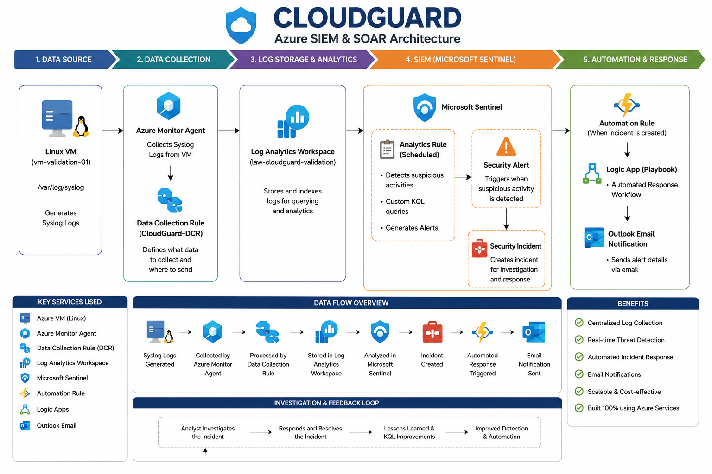

---

# Azure Services Used

| Service | Purpose |
|----------|----------|
| Azure Virtual Machine | Generates Linux Syslog logs |
| Azure Monitor Agent | Collects telemetry |
| Data Collection Rule | Defines log collection |
| Log Analytics Workspace | Stores collected logs |
| Microsoft Sentinel | SIEM and Incident Management |
| Analytics Rules | Detect suspicious activities |
| Automation Rules | Trigger response workflow |
| Logic Apps | Automated email notification |
| Outlook Connector | Sends incident email |

---

# Project Workflow

```
Linux VM
      │
      ▼
Azure Monitor Agent
      │
      ▼
Data Collection Rule
      │
      ▼
Log Analytics Workspace
      │
      ▼
Microsoft Sentinel
      │
      ▼
Analytics Rule
      │
      ▼
Security Incident
      │
      ▼
Automation Rule
      │
      ▼
Logic App
      │
      ▼
Email Notification
```

---

# Screenshots

## Resource Group

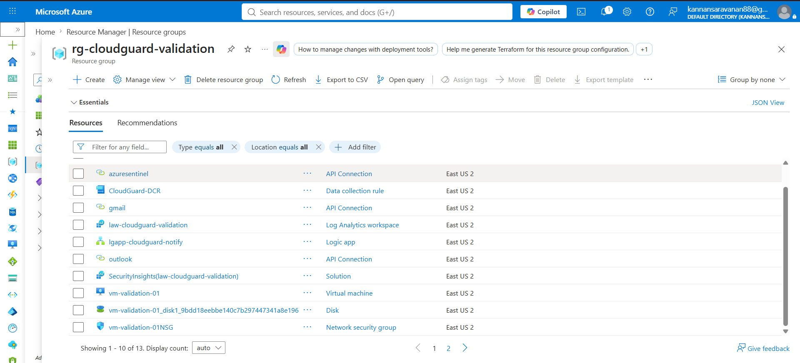

---

## Azure Virtual Machine

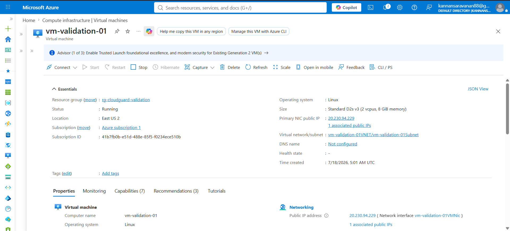

---

## Data Collection Rule

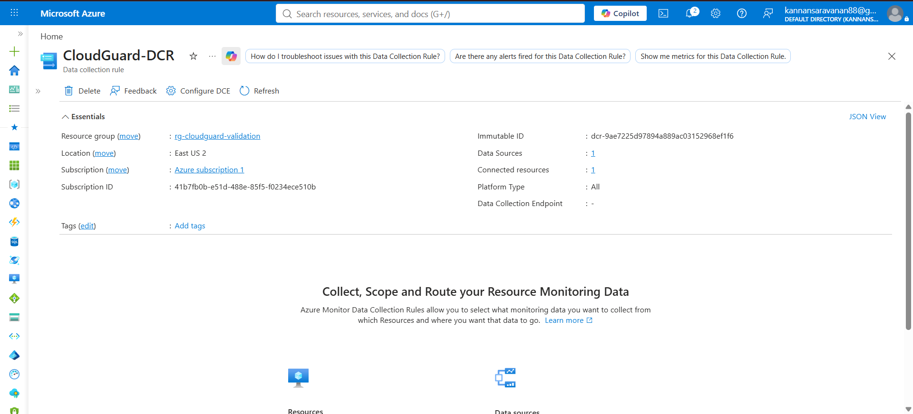

---

## Log Analytics Workspace

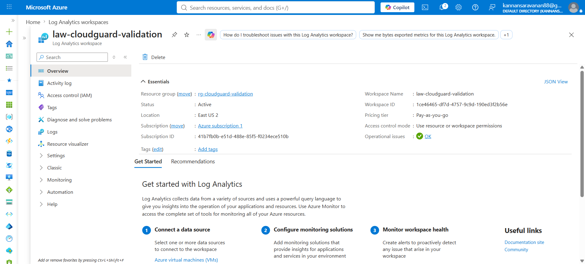

---

## KQL Query Validation

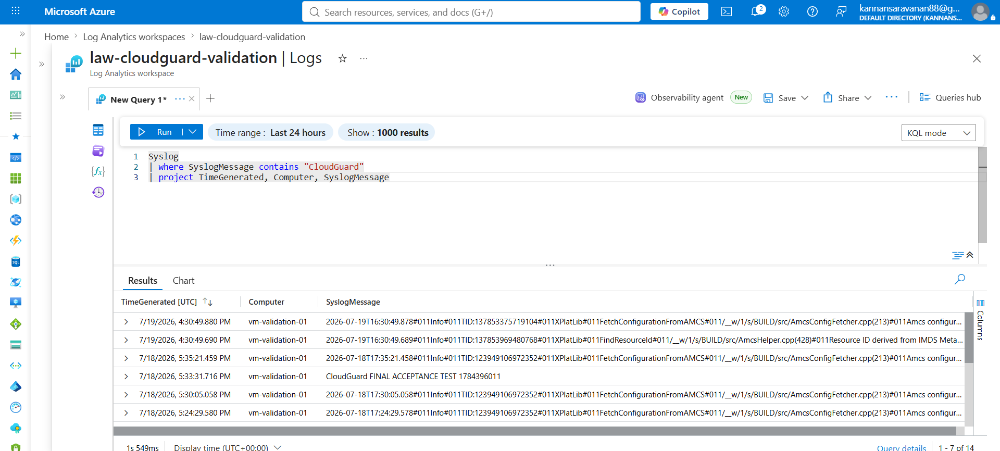

---

## Sentinel Analytics Rule

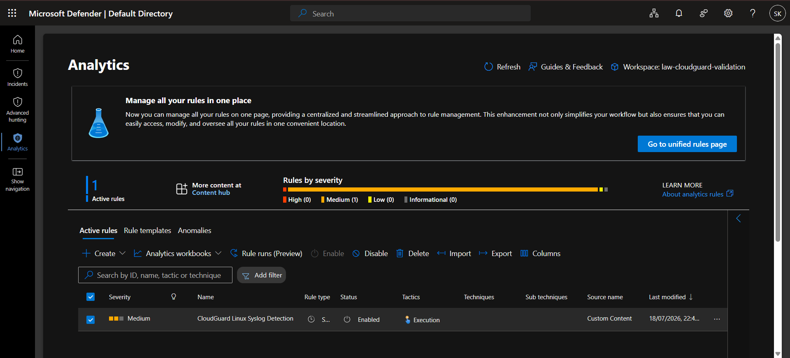

---

## Security Incident

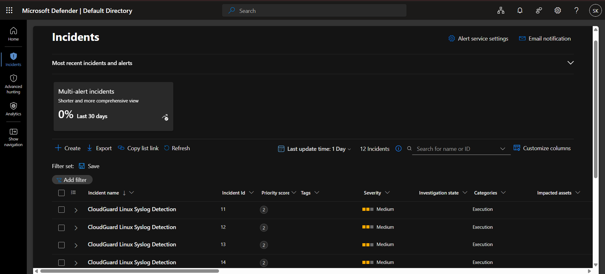

---

## Automation Rule

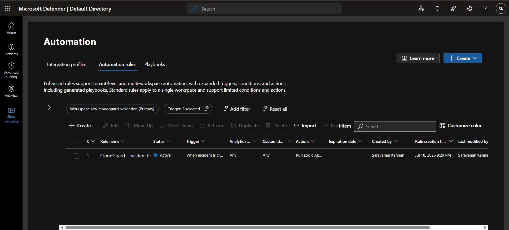

---

## Logic App

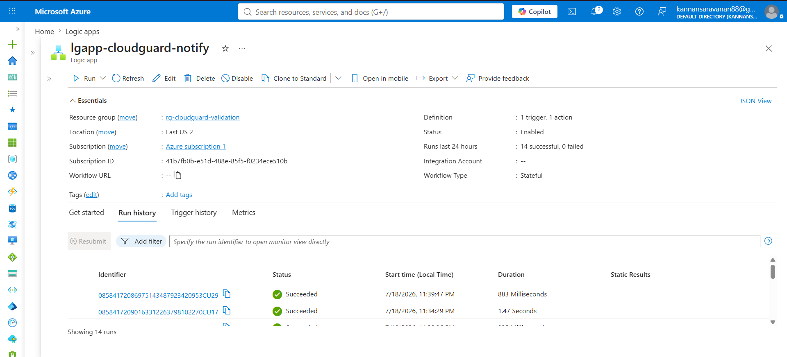

---

## Logic App Run History

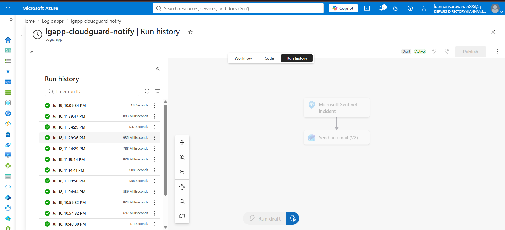

---

## Email Notification

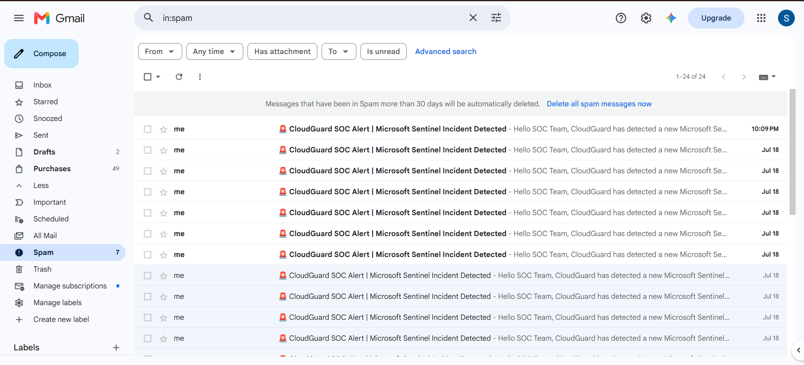

---

# KQL Validation Query

```kusto
Syslog
| where TimeGenerated > ago(24h)
| project TimeGenerated, Computer, Facility, ProcessName, SyslogMessage
| order by TimeGenerated desc
```

---

# Skills Demonstrated

- Microsoft Azure
- Microsoft Sentinel
- Azure Monitor
- Azure Monitor Agent
- Data Collection Rules
- Log Analytics Workspace
- Kusto Query Language (KQL)
- Logic Apps
- Security Incident Management
- Cloud Security Monitoring
- Security Operations (SOC)

---

# Future Improvements

- Teams Notifications
- Azure Functions Integration
- Defender for Cloud Integration
- Playbook Enhancements
- Multiple Detection Rules
- Threat Intelligence Integration

---

# Author

**Saravanan K**

Cloud & Azure Security Enthusiast

LinkedIn:
https://linkedin.com/in/saravanankannan10

GitHub:
https://github.com/Saravanagithub10
